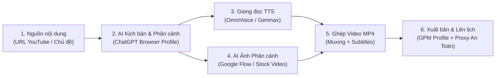
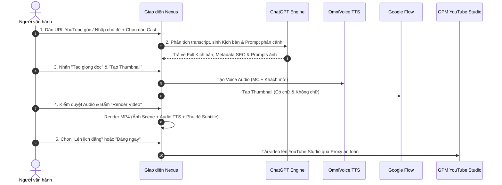

# HƯỚNG DẪN SỬ DỤNG HỆ THỐNG AUTO_YT (NEXUS STUDIO ENGINE)
> **Tài liệu hướng dẫn vận hành chuẩn dành cho thành viên mới (Onboarding & Operator Manual)**  
> *Phiên bản hệ thống: Nexus Studio Engine v2.0*

---

## MỤC LỤC
1. [Tổng quan hệ thống](#1-tổng-quan-hệ-thống)
2. [Checklist chuẩn bị & Khởi động 1 lần đầu](#2-checklist-chuẩn-bị--khởi-động-1-lần-đầu)
3. [Quy trình 5 bước sản xuất video tự động](#3-quy-trình-5-bước-sản-xuất-video-tự-động)
4. [Hướng dẫn chi tiết từng phân hệ trên Giao diện](#4-hướng-dẫn-chi-tiết-từng-phân-hệ-trên-giao-diện)
5. [Quy trình Khởi động & Khởi động lại an toàn](#5-quy-trình-khởi-động--khởi-động-lại-an-toàn)
6. [Bảng tra cứu lỗi thường gặp & Xử lý sự cố (FAQ)](#6-bảng-tra-cứu-lỗi-thường-gặp--xử-lý-sự-cố-faq)
7. [Bảng phím tắt & Thao tác nhanh (Cheat-Sheet)](#7-bảng-phím-tắt--thao-tác-nhanh-cheat-sheet)

---

## 1. TỔNG QUAN HỆ THỐNG

**Auto_YT** (Nexus Studio Engine) là nền tảng tự động hóa toàn diện quy trình sản xuất nội dung YouTube từ khâu lấy ý tưởng, viết kịch bản, tạo giọng đọc lồng tiếng, tạo hình ảnh phân cảnh, ghép video hoàn chỉnh cho đến xuất bản và lên lịch phát hành.

### 5 Dịch vụ trụ cột chạy ngầm
| Dịch vụ | Địa chỉ / Profile | Nhiệm vụ chính |
| :--- | :--- | :--- |
| **Backend API** | `http://127.0.0.1:8080` | Bộ não xử lý dữ liệu SQLite, điều phối tiến trình và render video. |
| **Frontend UI** | `http://localhost:5173` | Giao diện điều khiển Dark Mode trực quan cho người dùng. |
| **OmniVoice TTS** | `http://127.0.0.1:8011` | Máy chủ sinh giọng đọc tiếng Việt AI, hỗ trợ nhân bản giọng (Voice Cloning) và hội thoại nhiều vai. |
| **ChatGPT Service** | Profile `PROFILE_GPT_1` | Trình duyệt điều khiển tự động tạo kịch bản, dàn ý, metadata và câu hỏi tương tác. |
| **Google Flow** | Profile `PROFILE_GOOGLE_FLOW_1` | Trình duyệt tự động sinh ảnh phân cảnh chất lượng cao. |

---

## 2. CHECKLIST CHUẨN BỊ & KHỞI ĐỘNG 1 LẦN ĐẦU

### Bước 1: Khởi động hệ sinh thái
Nhấp đúp vào file thực thi tại thư mục gốc:
👉 **`run_autoyt.bat`** (hoặc `run_autoyt_restart.bat` nếu muốn khởi động lại mới toàn bộ).

Chờ terminal kiểm tra 5 dịch vụ và tự động mở trình duyệt tại: `http://localhost:5173`.

---

### Bước 2: Đăng nhập 2 tài khoản AI (Chỉ làm 1 lần đầu)
1. **ChatGPT**:
   - Chọn menu **Auto Login** ở thanh điều hướng bên trái.
   - Bấm **Mở trình duyệt ChatGPT** → Đăng nhập tài khoản ChatGPT của bạn → Trạng thái báo `Ready` là thành công.
2. **Google Flow (Tạo ảnh phân cảnh)**:
   - Chọn menu **Google Flow** ở thanh điều hướng.
   - Đăng nhập tài khoản Google Flow của bạn để sẵn sàng tạo hình ảnh phân cảnh.

---

### Bước 3: Thêm Kênh YouTube & GPM Profile (Channel Hub)
1. Mở menu **Channel Hub**.
2. Thêm kênh mới:
   - **Tên Kênh**: Tên hiển thị nhận diện.
   - **GPM Profile ID**: Nhập ID Profile từ phần mềm GPM-Login.
   - **Proxy**: Nhập Proxy riêng của kênh (đảm bảo nguyên tắc *Zero-Footprint* - không lộ địa chỉ IP thật của máy chủ).
   - **Khung giờ đăng mặc định**: Chọn khung giờ vàng đăng video (ví dụ: `19:30:00`).

---

## 3. QUY TRÌNH 5 BƯỚC SẢN XUẤT VIDEO TỰ ĐỘNG

---

### Bước 1: Nhập liệu & Sinh kịch bản (Video Fetcher)
1. Nhấp vào tab **Video Fetcher**.
2. Dán link video YouTube gốc vào ô URL (hoặc nhập nội dung văn bản thô).
3. Thiết lập thông số:
   - **Prompt Version**: Chọn định dạng kịch bản phù hợp (*Hội thoại 2 người*, *Phân tích chuyên sâu*, *Tin tức tóm tắt*...).
   - **Cast Settings (Phân vai giọng đọc)**:
     - `MC`: Chọn giọng MC dẫn chương trình.
     - `Khách mời 1`, `Khách mời 2`: Chọn giọng tương tác nếu là định dạng đối thoại/podcast.
4. Nhấn **🚀 Bắt đầu tạo (Fetch & Generate)**.
5. Hệ thống sẽ tự động bóc tách nội dung, viết lại kịch bản mới 100%, sinh các prompt vẽ ảnh tiếng Anh, tiêu đề hấp dẫn, mô tả chuẩn SEO, danh sách hashtag, thẻ tags và câu hỏi trắc nghiệm (Quiz).

---

### Bước 2: Tạo Thumbnail AI
1. Kéo xuống phần **Thumbnail Generator** trong chi tiết video.
2. Chọn hình thức:
   - **Tạo Thumbnail Có Chữ**: Tạo ảnh bìa nổi bật chứa tiêu đề dạng giật tít (Clickbait).
   - **Tạo Thumbnail Không Chữ**: Tạo ảnh phong cách nghệ thuật, sạch chữ.
3. Xem trước và chọn ảnh ưng ý để làm ảnh bìa chính thức.

---

### Bước 3: Tạo Giọng đọc & Kiểm duyệt (Audio Review)
1. Nhấn nút **🎵 Tạo Audio TTS**.
2. Hệ thống OmniVoice sẽ sinh âm thanh tự nhiên từng câu văn, tự động xử lý crossfade 10ms tránh tiếng nổ / click giữa các câu.
3. Khi hoàn tất, bảng **Audio Review Panel** sẽ hiển thị:
   - Nghe thử toàn bài hoặc bấm nghe từng câu riêng biệt.
   - Nếu có câu đọc chưa chuẩn (do dấu câu hoặc từ viết tắt), chỉnh sửa văn bản trực tiếp và bấm **Tạo lại câu này**.

---

### Bước 4: Render Video MP4 Hoàn chỉnh
1. Nhấn **🎬 Render Video MP4**.
2. Quá trình render sẽ tự động chạy ngầm:
   - Tự động gọi **Google Flow** tạo ảnh cho từng phân cảnh (Scene) hoặc lấy video nền từ kho **Stock Video**.
   - Muxing âm thanh giọng đọc TTS chất lượng cao.
   - Tự động chèn phụ đề (Subtitles) đồng bộ theo giọng đọc.
3. Bạn có thể theo dõi thanh tiến độ phần trăm (%) thời gian thực.

---

### Bước 5: Xuất bản & Lên lịch YouTube (Publish Pipeline)
1. Khi file MP4 đã sẵn sàng, chọn **Lên lịch đăng (Schedule)** hoặc **Đăng ngay (Publish Now)**.
2. Chọn Kênh YouTube mục tiêu.
3. Hệ thống sẽ tự động điều khiển GPM-Login qua Proxy:
   - Upload file video MP4 lên YouTube Studio.
   - Điền Tiêu đề, Mô tả, Tags, Thumbnail và Chương video (Chapters / Timestamps).
   - Tự động bình luận và ghim bình luận mở đầu (Pinned Comment) kèm câu hỏi Quiz tương tác.

---

## 4. HƯỚNG DẪN CHI TIẾT TỪNG PHÂN HỆ TRÊN GIAO DIỆN

### 1. Dashboard (Thư viện Video)
- Quản lý toàn bộ danh sách video đã lưu trong cơ sở dữ liệu.
- Bộ lọc thông minh theo trạng thái: *Tất cả*, *Đã đăng*, *Chưa đăng*, *Lỗi*.
- Tìm kiếm theo link gốc, tiêu đề hoặc nội dung tóm tắt.
- Nút **Mở trong GPM Studio**: Mở trực tiếp trang chỉnh sửa video trên YouTube Studio trong môi trường an toàn.

### 2. Trung tâm Job (Job Center)
- Giám sát toàn bộ các tiến trình nền đang chạy trong hệ thống (Tạo Script, Tạo Ảnh, TTS, Render, Upload).
- Xem nhật ký hoạt động (Logs) chi tiết từng giây.
- Cho phép bấm **Retry** (Thử lại) nếu một công đoạn nào đó gặp sự cố mạng mà không phải làm lại từ đầu.

### 3. Quản lý Bình luận (YouTube Comments)
- Tự động đồng bộ các bình luận mới nhất của khán giả từ các kênh về một nơi duy nhất.
- Hỗ trợ trả lời nhanh bình luận để tăng tương tác và đẩy mạnh đề xuất cho kênh.

### 4. Quản lý Kênh (Channel Hub)
- Quản lý toàn bộ danh sách Kênh YouTube, Fanpage Facebook và TikTok.
- Gán cố định mỗi kênh với một Profile GPM-Login và Proxy riêng biệt.
- Thiết lập lịch phát sóng và cấu hình mặc định cho từng kênh.

### 5. Cross-Poster (Đăng chéo Fanpage)
- Tái sử dụng video đã sản xuất để đăng tự động sang các trang Fanpage Facebook hoặc Reels giúp đa dạng hóa nguồn lưu lượng truy cập.

### 6. YouTube Downloader
- Công cụ tải nhanh video gốc, trích xuất file âm thanh MP3 hoặc bóc tách phụ đề (.srt) từ bất kỳ link YouTube nào để làm tư liệu.

### 7. Cài đặt Hệ thống & Kịch bản (Settings)
- Quản lý các mẫu Prompt (Prompt Templates): Tùy biến công thức viết kịch bản, độ dài, phong cách văn phong.
- Cấu hình phân vai đối thoại (Cast Settings): Gán giọng mặc định cho MC, Khách mời 1, Khách mời 2.
- Cài đặt Pipeline render và chọn chế độ hình ảnh (Google Flow Image hoặc Stock Video).

---

## 5. QUY TRÌNH KHỞI ĐỘNG & KHỞI ĐỘNG LẠI AN TOÀN

> [!IMPORTANT]
> **Quy tắc vàng khi Restart / Bảo trì hệ thống:**
> Tuyệt đối không khởi động lại khi hệ thống đang có tiến trình Render video hoặc Upload dở dang.

### Cách kiểm tra hệ thống rảnh (Idle Check):
1. Mở **Job Center** trên giao diện, kiểm tra không có job nào đang ở trạng thái `running` hoặc `processing`.
2. Hoặc kiểm tra qua API: `http://127.0.0.1:8080/api/system/maintenance-status` (yêu cầu `safe_to_restart: true`).

### Các lệnh điều khiển hệ thống:
- **Khởi động**: Chạy file `run_autoyt.bat`
- **Khởi động lại sạch**: Chạy file `run_autoyt_restart.bat`
- **Tắt toàn bộ hệ thống**: Chạy file `run_autoyt_stop.bat`

---

## 6. BẢNG TRA CỨU LỖI THƯỜNG GẶP & XỬ LÝ SỰ CỐ (FAQ)

| Tình huống / Thông báo lỗi | Nguyên nhân gốc rễ | Cách xử lý tức thì |
| :--- | :--- | :--- |
| **`ChatGPT Session Expired`** hoặc không sinh được kịch bản | Phiên đăng nhập trên trình duyệt ChatGPT hết hạn hoặc gặp CAPTCHA Cloudflare. | Vào tab **Auto Login** → Bấm **Mở trình duyệt ChatGPT** → Hoàn tất đăng nhập/xác minh → Đóng trình duyệt. |
| **Video bị dừng ở `waiting_for_image_service`** | Google Flow chưa đăng nhập hoặc profile bị ngắt kết nối. | Vào tab **Google Flow** → Kiểm tra trạng thái đăng nhập tài khoản Google. |
| **Âm thanh đọc bị lỗi dính chữ hoặc sai ngữ điệu** | Văn bản có ký tự lạ hoặc câu văn quá dài không có dấu ngắt. | Mở **Audio Review Panel** → Sửa lại dấu chấm/phẩy trong câu → Nhấn **Tạo lại câu này**. |
| **Không tải được video lên YouTube (Upload Error)** | Proxy của kênh bị gián đoạn hoặc GPM Profile chưa mở được cổng API. | Mở **Channel Hub** → Kiểm tra lại trạng thái kết nối GPM-Login (Port 19995) và Proxy của kênh đó. |
| **Giao diện báo `Không thể kết nối Backend`** | Dịch vụ Backend (port 8080) chưa chạy hoặc bị xung đột cổng. | Chạy file `run_autoyt_restart.bat` để làm sạch cổng và khởi động lại toàn bộ dịch vụ. |

---

## 7. BẢNG PHÍM TẮT & THAO TÁC NHANH (CHEAT-SHEET)

- **Xem nhanh tiến trình đang chạy**: Bấm tab **Trung tâm Job** (`/jobs`).
- **Nghe thử nhanh âm thanh video**: Bấm biểu tượng 🎵 trên danh sách video tại **Dashboard**.
- **Xem video MP4 đã render**: Nhấp vào nút **MP4 Preview** trên thẻ chi tiết video.
- **Sao chép nội dung SEO**: Nhấn nút **Sao chép Metadata** trong chi tiết video để lấy trọn bộ Tiêu đề + Mô tả + Tags + Chapters.
- **Đổi giao diện hình nền**: Nhấp vào bộ nút chuyển đổi hình nền (Canvas / Particles / Waves) ở góc trên bên phải màn hình.

---

*Chúc bạn tạo ra những video triệu view với Nexus Studio Engine!* 🚀
